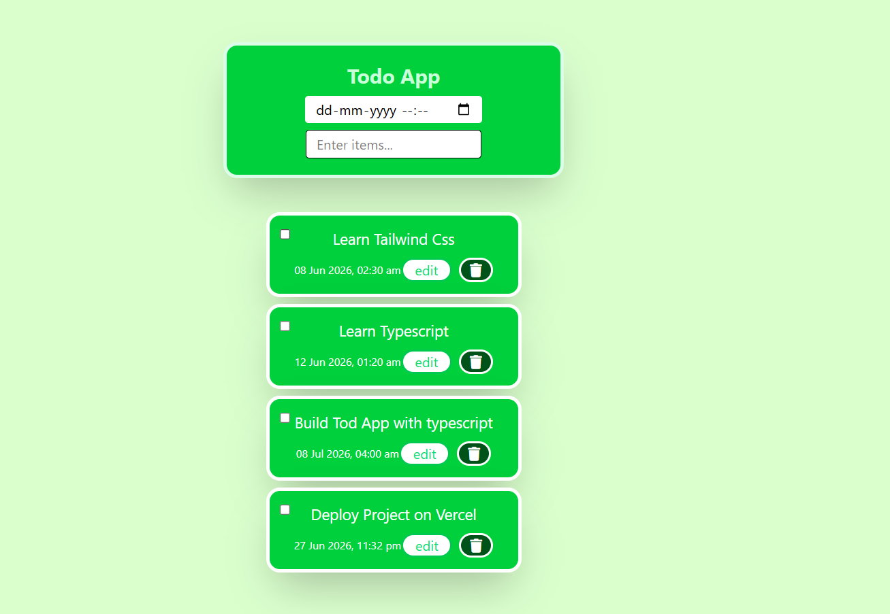

# React + TypeScript + Vite

📝 Todo App
A modern and responsive Todo Application built with React, TypeScript, Vite, and Tailwind CSS. This project helps users manage daily tasks efficiently with features like adding, editing, deleting, and marking tasks as completed.

## 🚀 Live Demo

👉 https://react-vite-todo-app-two.vercel.app/

## 📸 Screenshot



## 📌 Features

- ✅ Add new tasks
- ✏️ Edit existing tasks
- 🗑️ Delete tasks
- ✔️ Mark tasks as completed
- 🔔 Success and error notifications using Notyf
- 📱 Responsive design for mobile and desktop
- ⚡ Fast performance with Vite
- 🎨 Styled using Tailwind CSS
- 🔒 Type safety with TypeScript

## 🛠️ Tech Stack

- React
- TypeScript
- Vite
- Tailwind CSS
- Notyf

## 📦 Installation

Clone the repository:
git clone https://github.com/Noushidh/react-vite-todo-app.git

Navigate to the project folder:

cd react-vite-todo-app

Install dependencies:

npm install

Start the development server:

npm run dev

🏗️ Production Build
npm run build

## 📁 Project Structure

```text
src/
├── assets/
│   └── todo-app.png
├── components/
│   └── TodoApp/
│       └── TodoApp.tsx
├── App.tsx
├── main.tsx
├── index.css

public/

package.json
vite.config.ts
tsconfig.json
README.md
```

## 🎯 Learning Outcomes

Through this project, I practiced:

React component architecture
TypeScript type safety
State management using React Hooks
CRUD operations
Responsive UI design with Tailwind CSS
Notification handling using Notyf
Deploying applications with Vercel

## 👨‍💻 Author
Noushidh K

GitHub: https://github.com/Noushidh

## ⭐ Support
If you found this project useful, consider giving it a star ⭐ on GitHub.

